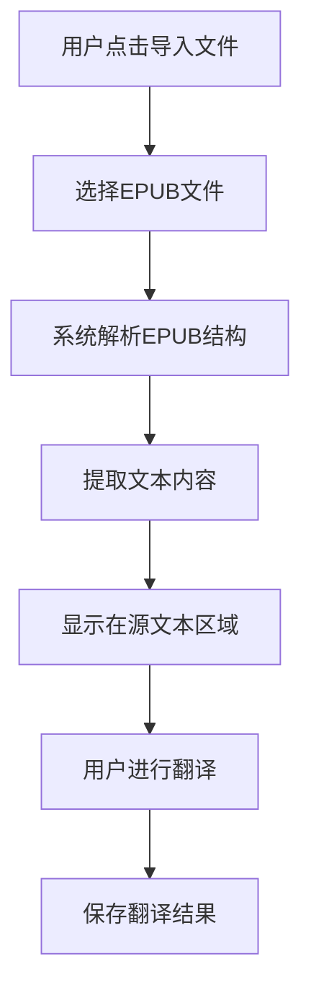

# EPUB文件格式支持功能需求文档

## 1. 产品概述
为现有的Python翻译工具添加EPUB电子书文件格式支持，使用户能够直接导入和翻译EPUB格式的电子书文件。
- 扩展现有文件处理能力，支持EPUB 2.0和3.0格式的电子书文件解析和文本提取
- 保持与现有翻译工作流程的完全兼容，用户可以像处理普通文本文件一样处理EPUB文件

## 2. 核心功能

### 2.1 用户角色
无需区分用户角色，所有用户均可使用EPUB文件翻译功能。

### 2.2 功能模块
本次功能扩展主要涉及以下页面的增强：
1. **主界面**：文件导入功能增强，支持EPUB文件类型选择
2. **翻译界面**：显示EPUB文件的文本内容，支持章节结构展示

### 2.3 页面详情

| 页面名称 | 模块名称 | 功能描述 |
|---------|----------|----------|
| 主界面 | 文件导入模块 | 在文件选择对话框中添加EPUB文件类型支持（*.epub），自动识别和解析EPUB文件结构 |
| 主界面 | 文本显示区域 | 显示从EPUB文件提取的纯文本内容，保持章节分隔和基本格式 |
| 主界面 | 翻译功能 | 使用现有翻译引擎处理EPUB提取的文本内容，支持分章节翻译 |

## 3. 核心流程

用户使用EPUB翻译功能的主要操作流程：
1. 用户点击"导入文件"按钮
2. 在文件选择对话框中选择EPUB文件类型
3. 系统自动解析EPUB文件，提取文本内容
4. 在源文本区域显示提取的文本内容
5. 用户进行翻译操作（与现有流程相同）
6. 系统保存翻译结果为文本文件

## 4. 用户界面设计

### 4.1 设计风格
保持与现有界面风格完全一致：
- 主色调：系统默认色彩方案
- 按钮样式：标准Tkinter按钮样式
- 字体：系统默认字体，12pt
- 布局风格：现有的双栏文本编辑器布局
- 图标样式：使用系统标准文件图标

### 4.2 页面设计概览

| 页面名称 | 模块名称 | UI元素 |
|---------|----------|--------|
| 主界面 | 文件选择对话框 | 在现有文件类型列表中添加"EPUB文件 (*.epub)"选项，保持对话框原有样式和布局 |
| 主界面 | 状态栏 | 显示EPUB文件解析进度和章节信息，使用现有状态栏样式 |
| 主界面 | 文本编辑区 | 在源文本区域显示EPUB提取内容，添加章节分隔线标识 |

### 4.3 响应性
保持现有的桌面应用设计，无需额外的响应式适配。