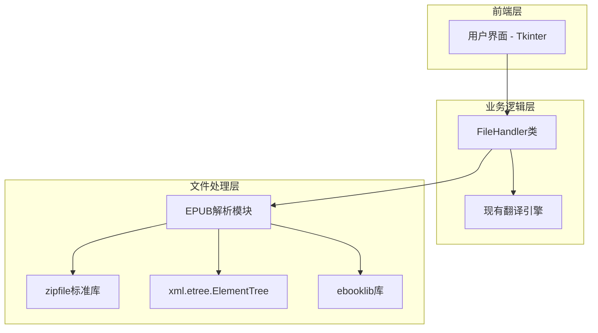
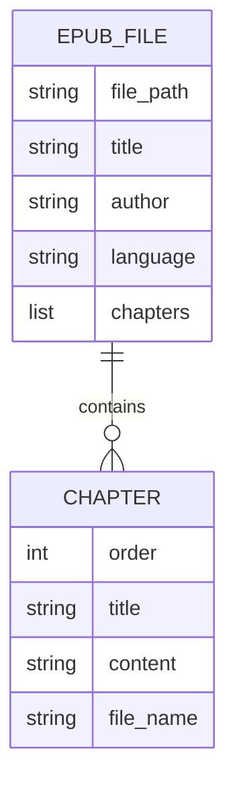

# EPUB支持技术架构文档

## 1. 架构设计



## 2. 技术描述

* 前端：Tkinter（现有）

* 文件处理：FileHandler类扩展 + ebooklib\@0.18

* EPUB解析：zipfile + xml.etree.ElementTree + ebooklib

* 翻译引擎：现有TranslatorEngine（无需修改）

## 3. 路由定义

本项目为桌面应用，无Web路由。主要功能入口：

* 文件导入：通过文件选择对话框

* EPUB处理：FileHandler.read\_epub\_file()方法

* 文本显示：现有文本编辑器组件

## 4. API定义

### 4.1 核心API

EPUB文件读取接口

```python
def read_epub_file(self, file_path: str) -> str
```

参数说明：

| 参数名称       | 参数类型   | 是否必需 | 描述          |
| ---------- | ------ | ---- | ----------- |
| file\_path | string | true | EPUB文件的完整路径 |

返回值：

| 参数名称    | 参数类型   | 描述               |
| ------- | ------ | ---------------- |
| content | string | 提取的纯文本内容，包含章节分隔符 |

示例：

```python
# 调用示例
file_handler = FileHandler()
content = file_handler.read_epub_file("example.epub")
```

EPUB文件信息获取接口

```python
def get_epub_info(self, file_path: str) -> dict
```

参数说明：

| 参数名称       | 参数类型   | 是否必需 | 描述          |
| ---------- | ------ | ---- | ----------- |
| file\_path | string | true | EPUB文件的完整路径 |

返回值：

```json
{
    "title": "书籍标题",
    "author": "作者",
    "chapters": 15,
    "language": "zh-CN"
}
```

## 5. 数据模型

### 5.1 数据模型定义

EPUB文件处理不涉及数据库存储，主要处理内存中的文件结构：



### 5.2 数据定义语言

无需数据库，使用内存数据结构：

```python
# EPUB文件信息结构
epub_info = {
    'title': str,           # 书籍标题
    'author': str,          # 作者
    'language': str,        # 语言代码
    'chapters': List[dict], # 章节列表
    'metadata': dict        # 其他元数据
}

# 章节信息结构
chapter_info = {
    'order': int,           # 章节顺序
    'title': str,           # 章节标题
    'content': str,         # 章节内容
    'file_name': str        # 源文件名
}
```

