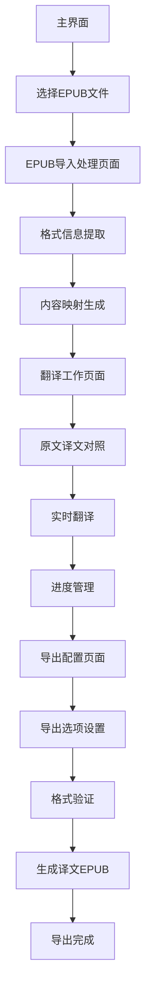

# EPUB翻译工具功能增强需求文档

## 1. Product Overview

本项目旨在为现有的轻小说翻译器V1.1增加完整的EPUB文件处理功能，实现从导入、翻译到导出的完整EPUB翻译工作流。
该功能将解决用户对电子书翻译的需求，支持保持原始格式和样式的高质量EPUB文件翻译，为翻译工作者和阅读爱好者提供专业的电子书翻译解决方案。

## 2. Core Features

### 2.1 User Roles

| Role | Registration Method | Core Permissions |
|------|---------------------|------------------|
| 普通用户 | 直接使用桌面应用 | 可导入EPUB文件、进行翻译、导出译文EPUB |

### 2.2 Feature Module

我们的EPUB翻译工具功能增强包含以下主要页面：
1. **主界面**：文件导入区域、翻译工作区、控制面板
2. **EPUB导入处理页面**：格式信息提取、内容映射、进度显示
3. **翻译工作页面**：原文译文对照、实时翻译、进度管理
4. **导出配置页面**：导出选项设置、格式验证、文件生成

### 2.3 Page Details

| Page Name | Module Name | Feature description |
|-----------|-------------|---------------------|
| 主界面 | 文件导入区域 | 支持EPUB文件拖拽导入、文件选择对话框、文件格式验证 |
| 主界面 | 翻译工作区 | 原文译文双栏显示、实时编辑、同步滚动、行号显示 |
| 主界面 | 控制面板 | 翻译模式选择、开始/暂停翻译、导出EPUB按钮 |
| EPUB导入处理页面 | 格式信息提取 | 提取CSS样式、章节结构、元数据信息、目录结构 |
| EPUB导入处理页面 | 内容映射生成 | 创建mapping文件夹、生成内容键值对映射、图片Base64转换 |
| EPUB导入处理页面 | 进度显示 | 显示导入进度、处理状态、错误信息提示 |
| 翻译工作页面 | 原文译文对照 | 分段显示原文内容、译文编辑区域、键值对关联显示 |
| 翻译工作页面 | 实时翻译 | 调用翻译API、批量翻译、译文质量检查 |
| 翻译工作页面 | 进度管理 | 翻译进度跟踪、已完成段落标记、保存状态同步 |
| 导出配置页面 | 导出选项设置 | 选择导出路径、文件名设置、格式选项配置 |
| 导出配置页面 | 格式验证 | 验证译文完整性、检查格式兼容性、预览导出效果 |
| 导出配置页面 | 文件生成 | 合并译文与格式信息、重建EPUB结构、生成最终文件 |

## 3. Core Process

**主要用户操作流程：**

1. **EPUB导入流程**：用户选择EPUB文件 → 系统提取格式信息和内容 → 创建mapping文件夹 → 生成内容映射和图片Base64编码 → 显示导入成功
2. **翻译工作流程**：加载原文内容到工作区 → 用户选择翻译模式 → 系统调用翻译API或用户手动翻译 → 译文实时保存到映射文件 → 显示翻译进度
3. **EPUB导出流程**：用户点击导出按钮 → 系统读取译文映射 → 结合原始格式信息 → 重建EPUB文件结构 → 生成译文EPUB文件

## 4. User Interface Design

### 4.1 Design Style

- **主色调**：深蓝色 (#2C3E50) 和浅灰色 (#ECF0F1)
- **辅助色**：绿色 (#27AE60) 用于成功状态，橙色 (#F39C12) 用于警告，红色 (#E74C3C) 用于错误
- **按钮样式**：圆角矩形按钮，带有轻微阴影效果
- **字体**：微软雅黑 12px（正文），14px（标题），10px（辅助信息）
- **布局风格**：卡片式布局，顶部导航栏，左右分栏工作区
- **图标风格**：使用Unicode表情符号和简洁的几何图标

### 4.2 Page Design Overview

| Page Name | Module Name | UI Elements |
|-----------|-------------|-------------|
| 主界面 | 文件导入区域 | 拖拽区域采用虚线边框，中央显示📁图标和"拖拽EPUB文件到此处"文字，支持点击选择文件 |
| 主界面 | 翻译工作区 | 左右分栏布局，每栏包含行号区域（灰色背景#F0F0F0）和文本编辑区域（白色背景），支持同步滚动 |
| 主界面 | 控制面板 | 水平排列的按钮组，包含翻译模式下拉框、开始/暂停按钮（绿色）、导出按钮（蓝色） |
| EPUB导入处理页面 | 进度显示 | 进度条采用蓝色填充，显示百分比和当前处理步骤，下方显示详细日志信息 |
| 翻译工作页面 | 原文译文对照 | 原文区域只读显示，译文区域可编辑，每个段落显示唯一键标识符，已翻译段落显示绿色边框 |
| 导出配置页面 | 导出选项设置 | 表单布局，包含文件路径选择器、文件名输入框、格式选项复选框，底部显示预览信息 |

### 4.3 Responsiveness

本应用为桌面应用程序，主要针对Windows平台设计，支持窗口大小调整时的自适应布局，最小窗口尺寸为1024x768像素。界面元素支持鼠标交互，文本区域支持键盘快捷键操作。