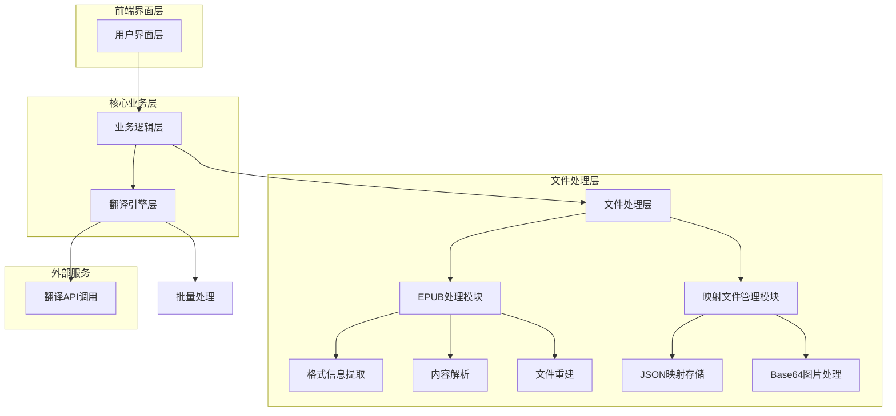
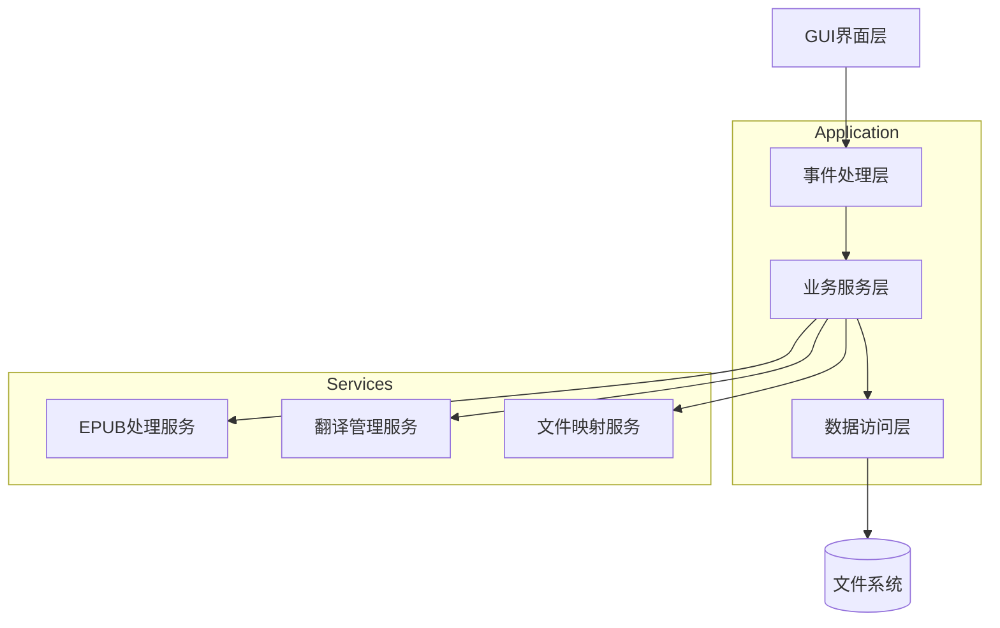
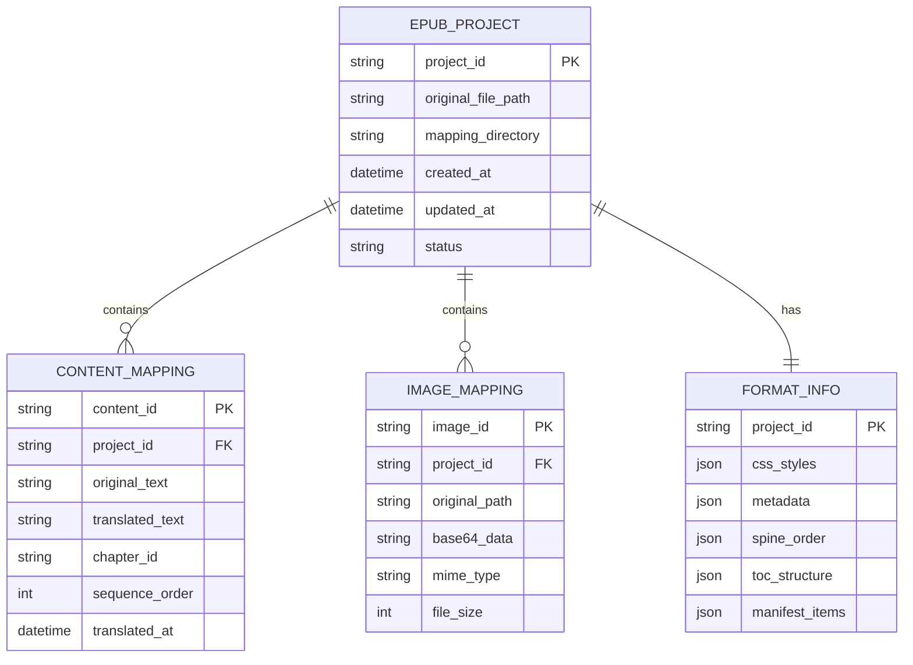

# EPUB翻译工具技术架构文档

## 1. Architecture design



## 2. Technology Description

- Frontend: Tkinter (Python内置GUI库) + ttk主题组件
- Backend: Python 3.8+ 
- EPUB处理: ebooklib + BeautifulSoup4
- 图片处理: base64 (Python内置) + Pillow
- 数据存储: JSON文件格式
- 翻译服务: 现有翻译API集成

## 3. Route definitions

| Route | Purpose |
|-------|---------|
| /main | 主界面，显示文件导入区域和翻译工作区 |
| /epub_import | EPUB导入处理界面，显示导入进度和处理状态 |
| /translation_work | 翻译工作界面，提供原文译文对照编辑功能 |
| /export_config | 导出配置界面，设置导出选项和生成EPUB文件 |

## 4. API definitions

### 4.1 Core API

EPUB文件导入处理
```
POST /api/epub/import
```

Request:
| Param Name | Param Type | isRequired | Description |
|------------|------------|------------|-------------|
| file_path | string | true | EPUB文件的完整路径 |
| extract_images | boolean | false | 是否提取并转换图片为Base64，默认true |

Response:
| Param Name | Param Type | Description |
|------------|------------|-------------|
| success | boolean | 导入是否成功 |
| mapping_path | string | 生成的mapping文件夹路径 |
| content_count | integer | 提取的内容段落数量 |
| image_count | integer | 处理的图片数量 |

Example:
```json
{
  "success": true,
  "mapping_path": "/path/to/book/mapping",
  "content_count": 245,
  "image_count": 12
}
```

翻译内容更新
```
PUT /api/translation/update
```

Request:
| Param Name | Param Type | isRequired | Description |
|------------|------------|------------|-------------|
| mapping_path | string | true | mapping文件夹路径 |
| content_key | string | true | 内容的唯一键标识符 |
| translated_text | string | true | 翻译后的文本内容 |

Response:
| Param Name | Param Type | Description |
|------------|------------|-------------|
| success | boolean | 更新是否成功 |
| updated_at | string | 更新时间戳 |

EPUB文件导出
```
POST /api/epub/export
```

Request:
| Param Name | Param Type | isRequired | Description |
|------------|------------|------------|-------------|
| mapping_path | string | true | mapping文件夹路径 |
| output_path | string | true | 导出文件的目标路径 |
| preserve_format | boolean | false | 是否保持原始格式，默认true |

Response:
| Param Name | Param Type | Description |
|------------|------------|-------------|
| success | boolean | 导出是否成功 |
| output_file | string | 生成的EPUB文件路径 |
| file_size | integer | 生成文件的大小（字节） |

## 5. Server architecture diagram



## 6. Data model

### 6.1 Data model definition



### 6.2 Data Definition Language

Content Mapping File (content_mapping.json)
```json
{
  "project_info": {
    "project_id": "epub_20241201_001",
    "original_file": "/path/to/original.epub",
    "created_at": "2024-12-01T10:00:00Z",
    "updated_at": "2024-12-01T15:30:00Z"
  },
  "content_mappings": {
    "content_001": {
      "original_text": "Chapter 1: The Beginning",
      "translated_text": "第一章：开始",
      "chapter_id": "chapter01",
      "sequence_order": 1,
      "translated_at": "2024-12-01T12:00:00Z"
    },
    "content_002": {
      "original_text": "It was a dark and stormy night...",
      "translated_text": "那是一个黑暗而暴风雨的夜晚...",
      "chapter_id": "chapter01",
      "sequence_order": 2,
      "translated_at": "2024-12-01T12:05:00Z"
    }
  }
}
```

Image Mapping File (images.json)
```json
{
  "image_mappings": {
    "img_001": {
      "original_path": "images/cover.jpg",
      "base64_data": "data:image/jpeg;base64,/9j/4AAQSkZJRgABAQEAYABgAAD...",
      "mime_type": "image/jpeg",
      "file_size": 45678
    },
    "img_002": {
      "original_path": "images/chapter01_illustration.png",
      "base64_data": "data:image/png;base64,iVBORw0KGgoAAAANSUhEUgAA...",
      "mime_type": "image/png",
      "file_size": 123456
    }
  }
}
```

Format Information File (format_info.json)
```json
{
  "metadata": {
    "title": "Sample Book",
    "author": "John Doe",
    "language": "en",
    "identifier": "urn:uuid:12345678-1234-1234-1234-123456789012"
  },
  "css_styles": {
    "stylesheet1.css": "body { font-family: serif; margin: 1em; }",
    "chapter.css": "h1 { color: #333; font-size: 1.5em; }"
  },
  "spine_order": [
    "titlepage.xhtml",
    "chapter01.xhtml",
    "chapter02.xhtml"
  ],
  "toc_structure": [
    {
      "title": "Chapter 1",
      "href": "chapter01.xhtml",
      "level": 1
    },
    {
      "title": "Chapter 2", 
      "href": "chapter02.xhtml",
      "level": 1
    }
  ],
  "manifest_items": {
    "chapter01.xhtml": {
      "media_type": "application/xhtml+xml",
      "properties": null
    },
    "stylesheet1.css": {
      "media_type": "text/css",
      "properties": null
    }
  }
}
```