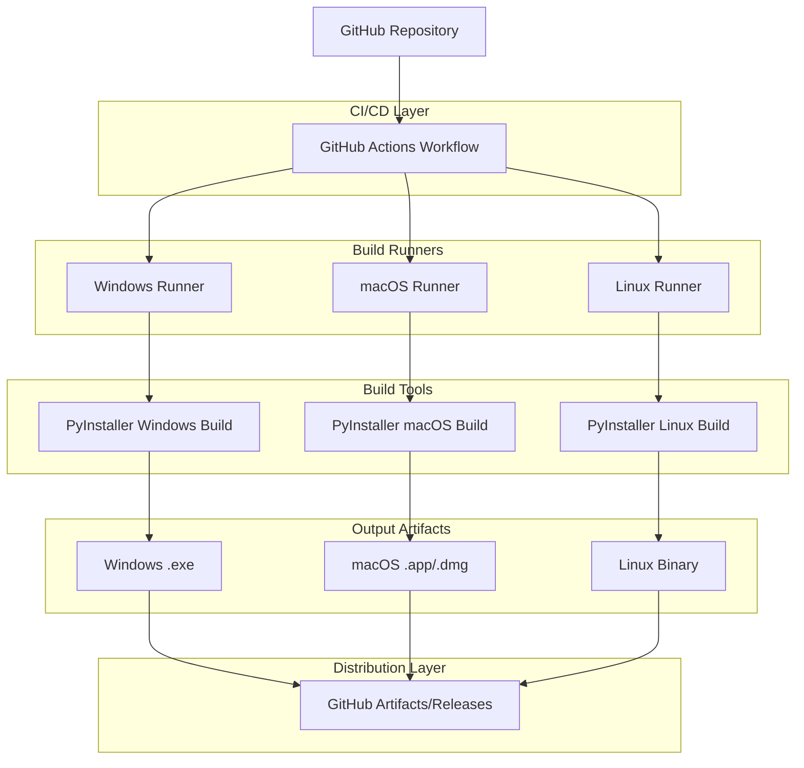
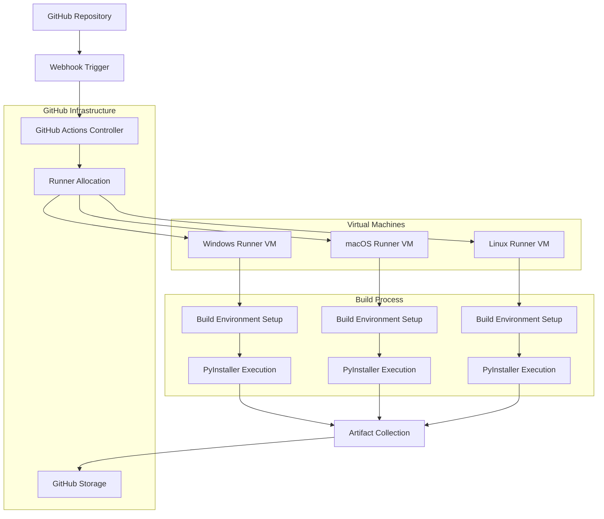
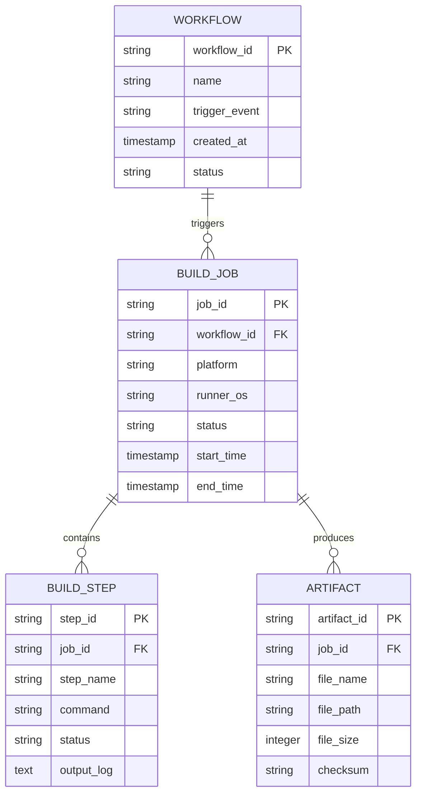

# GitHub Actions跨平台打包技术架构文档

## 1. 架构设计



## 2. 技术描述

- **CI/CD平台**: GitHub Actions
- **构建环境**: 
  - Windows: windows-latest (Windows Server 2022)
  - macOS: macos-latest (macOS 12)
  - Linux: ubuntu-latest (Ubuntu 22.04)
- **Python版本**: Python 3.11
- **打包工具**: PyInstaller 5.x
- **依赖管理**: pip + requirements.txt
- **缓存策略**: GitHub Actions Cache

## 3. 工作流定义

| 触发条件 | 描述 |
|----------|------|
| push (main分支) | 代码推送到主分支时触发开发构建 |
| create (tags) | 创建版本标签时触发发布构建 |
| workflow_dispatch | 手动触发构建（支持参数选择） |

## 4. 构建流程定义

### 4.1 核心工作流

**环境准备阶段**
```yaml
- name: Setup Python
  uses: actions/setup-python@v4
  with:
    python-version: '3.11'
    cache: 'pip'
```

**依赖安装阶段**
```yaml
- name: Install dependencies
  run: |
    python -m pip install --upgrade pip
    pip install pyinstaller
    pip install -r requirements.txt
```

**跨平台构建阶段**
```yaml
- name: Build with PyInstaller
  run: |
    pyinstaller translator.spec
```

### 4.2 平台特定配置

**Windows构建配置**
```yaml
strategy:
  matrix:
    os: [windows-latest]
    include:
      - os: windows-latest
        artifact_name: 轻小说翻译器V1.1-Windows-x64.exe
        build_command: pyinstaller translator.spec
```

**macOS构建配置**
```yaml
strategy:
  matrix:
    os: [macos-latest]
    include:
      - os: macos-latest
        artifact_name: 轻小说翻译器V1.1-macOS-Universal.app
        build_command: pyinstaller translator.spec
```

**Linux构建配置**
```yaml
strategy:
  matrix:
    os: [ubuntu-latest]
    include:
      - os: ubuntu-latest
        artifact_name: 轻小说翻译器V1.1-Linux-x64
        build_command: pyinstaller translator.spec
```

## 5. 服务器架构图



## 6. 数据模型

### 6.1 数据模型定义



### 6.2 配置文件结构

**GitHub Actions工作流配置 (.github/workflows/build.yml)**
```yaml
name: Cross-Platform Build

on:
  push:
    branches: [ main ]
  create:
    tags:
      - 'v*'
  workflow_dispatch:
    inputs:
      build_type:
        description: 'Build type'
        required: true
        default: 'development'
        type: choice
        options:
        - development
        - release

jobs:
  build:
    strategy:
      matrix:
        os: [windows-latest, macos-latest, ubuntu-latest]
    runs-on: ${{ matrix.os }}
    
    steps:
    - uses: actions/checkout@v4
    
    - name: Set up Python
      uses: actions/setup-python@v4
      with:
        python-version: '3.11'
        cache: 'pip'
    
    - name: Install dependencies
      run: |
        python -m pip install --upgrade pip
        pip install pyinstaller
        pip install -r requirements.txt
    
    - name: Build application
      run: pyinstaller translator.spec
    
    - name: Upload artifacts
      uses: actions/upload-artifact@v3
      with:
        name: 轻小说翻译器V1.1-${{ matrix.os }}
        path: dist/
```

**依赖配置文件 (requirements.txt)**
```
tkinter
httpx>=0.24.0
ebooklib>=0.18
beautifulsoup4>=4.12.0
Pillow>=9.5.0
chardet>=5.1.0
lxml>=4.9.0
```

**PyInstaller配置优化 (translator.spec)**
```python
# 跨平台兼容性配置
import sys
import os

# 平台特定配置
if sys.platform == 'win32':
    icon_file = 'assets/icon.ico'
    console = False
elif sys.platform == 'darwin':
    icon_file = 'assets/icon.icns'
    console = False
else:  # Linux
    icon_file = None
    console = True

# 构建配置
exe = EXE(
    pyz,
    a.scripts,
    a.binaries,
    a.zipfiles,
    a.datas,
    [],
    name='轻小说翻译器V1.1',
    debug=False,
    bootloader_ignore_signals=False,
    strip=False,
    upx=True,
    console=console,
    icon=icon_file,
)
```