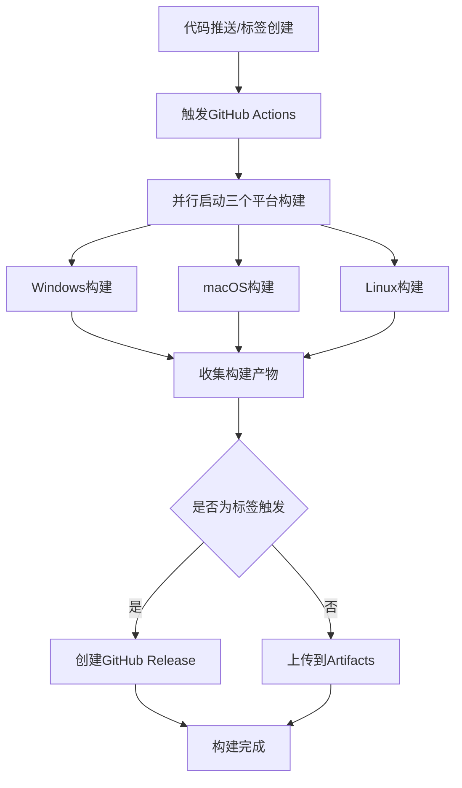

# GitHub Actions跨平台打包需求文档

## 1. 产品概述

基于GitHub Actions的CI/CD服务，为轻小说翻译器V1.1项目实现自动化跨平台打包解决方案，支持Windows、macOS和Linux三大主流操作系统的可执行文件生成。

- 解决手动跨平台打包的复杂性和时间成本问题，提供统一的自动化构建流程
- 面向开源项目维护者和需要多平台发布的开发团队，简化发布流程并确保构建一致性

## 2. 核心功能

### 2.1 用户角色

| 角色 | 访问方式 | 核心权限 |
|------|----------|----------|
| 项目维护者 | GitHub仓库管理员权限 | 可触发构建、管理发布、配置工作流 |
| 开发者 | GitHub仓库协作者权限 | 可查看构建状态、下载构建产物 |
| 最终用户 | GitHub公开访问 | 可下载发布的可执行文件 |

### 2.2 功能模块

我们的跨平台打包需求包含以下主要功能：

1. **自动化构建触发**：代码推送触发、标签发布触发、手动触发
2. **多平台并行构建**：Windows、macOS、Linux同时构建
3. **构建产物管理**：自动上传、版本标记、发布管理
4. **构建状态监控**：实时状态反馈、错误日志收集

### 2.3 功能详情

| 功能模块 | 子功能 | 功能描述 |
|----------|--------|----------|
| 构建触发器 | 代码推送触发 | 监听main分支推送，自动启动构建流程 |
| 构建触发器 | 标签发布触发 | 检测版本标签推送，触发正式发布构建 |
| 构建触发器 | 手动触发 | 提供workflow_dispatch手动触发选项 |
| 多平台构建 | Windows构建 | 在windows-latest环境中使用PyInstaller打包exe文件 |
| 多平台构建 | macOS构建 | 在macos-latest环境中打包app文件，支持Intel和Apple Silicon |
| 多平台构建 | Linux构建 | 在ubuntu-latest环境中打包Linux可执行文件 |
| 依赖管理 | Python环境配置 | 自动安装Python 3.11，配置虚拟环境 |
| 依赖管理 | 包依赖安装 | 根据requirements.txt安装项目依赖 |
| 依赖管理 | 系统依赖处理 | 处理不同平台的系统级依赖差异 |
| 构建优化 | 缓存机制 | 缓存Python依赖和构建中间文件 |
| 构建优化 | 并行构建 | 多平台同时进行，减少总构建时间 |
| 产物管理 | 文件上传 | 自动上传构建产物到GitHub Artifacts |
| 产物管理 | 版本发布 | 标签触发时自动创建GitHub Release |
| 产物管理 | 文件命名 | 按平台和版本规范命名构建文件 |

## 3. 核心流程

### 主要构建流程

1. **触发阶段**：开发者推送代码或创建版本标签到GitHub仓库
2. **环境准备**：GitHub Actions自动分配三个不同平台的虚拟机环境
3. **依赖安装**：各平台并行安装Python环境和项目依赖包
4. **代码构建**：使用PyInstaller根据translator.spec配置进行打包
5. **产物收集**：收集各平台生成的可执行文件并进行重命名
6. **结果发布**：上传到GitHub Artifacts或创建Release发布

### 页面导航流程图

## 4. 用户界面设计

### 4.1 设计风格

- **主色调**：GitHub主题色（#24292e深色，#f6f8fa浅色背景）
- **按钮风格**：GitHub标准按钮样式，圆角边框
- **字体**：系统默认字体，构建日志使用等宽字体
- **布局风格**：GitHub Actions标准界面布局，左侧导航，右侧内容区
- **图标风格**：使用GitHub Octicons图标集，简洁现代

### 4.2 界面设计概览

| 界面名称 | 模块名称 | UI元素 |
|----------|----------|--------|
| Actions主页 | 工作流列表 | 工作流状态徽章、运行历史列表、触发按钮 |
| 构建详情页 | 构建日志 | 实时日志输出、平台标签、进度指示器 |
| 构建详情页 | 产物下载 | 文件列表、下载链接、文件大小显示 |
| Release页面 | 版本发布 | 版本号标签、更新日志、平台文件下载区 |

### 4.3 响应式设计

- **桌面优先**：主要面向开发者在桌面环境使用
- **移动适配**：支持移动设备查看构建状态和下载文件
- **触控优化**：按钮和链接适配触控操作