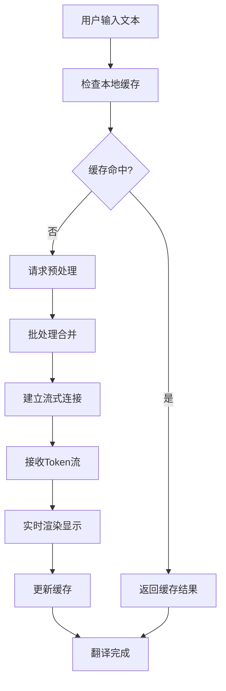

# Python翻译工具流式输出功能与API通信优化需求文档

## 1. 产品概述

本文档描述了为现有Python翻译工具新增流式输出功能和API通信优化的需求。目标是提升用户体验，实现翻译内容的实时显示，同时优化API通信效率和稳定性。

该功能将解决当前翻译过程中用户需要等待完整结果的问题，通过流式渲染让用户能够实时看到翻译进度，并通过通信优化提升整体性能。

## 2. 核心功能

### 2.1 用户角色

本功能不涉及新的用户角色区分，所有现有用户均可使用新功能。

### 2.2 功能模块

本需求涉及以下主要功能模块：

1. **流式输出显示模块**：实现翻译Token的实时渲染和显示
2. **API通信优化模块**：提升API请求效率和稳定性
3. **缓存管理模块**：智能缓存策略减少重复请求
4. **批处理优化模块**：请求批处理提升处理效率

### 2.3 页面详情

| 页面名称 | 模块名称 | 功能描述 |
|---------|---------|----------|
| 主翻译界面 | 流式输出显示区域 | 实时显示API返回的翻译Token，支持逐字符/逐词渲染 |
| 主翻译界面 | 进度指示器 | 显示流式翻译的实时进度和状态 |
| 主翻译界面 | 缓存状态指示 | 显示缓存命中情况和优化效果 |
| 设置界面 | 流式输出配置 | 配置流式输出的渲染速度、缓冲区大小等参数 |
| 设置界面 | 通信优化配置 | 配置批处理大小、缓存策略、压缩选项等 |

## 3. 核心流程

### 3.1 流式翻译流程

用户发起翻译请求 → 系统检查缓存 → 建立流式连接 → 接收Token流 → 实时渲染显示 → 完成翻译

### 3.2 通信优化流程

请求预处理 → 批处理合并 → 缓存检查 → 压缩传输 → 响应解析 → 结果缓存

## 4. 用户界面设计

### 4.1 设计风格

- 主色调：保持现有的蓝色系（#2196F3）和绿色系（#4CAF50）
- 新增流式效果色：渐变蓝色（#1976D2 到 #42A5F5）
- 按钮样式：圆角按钮，支持流式状态指示
- 字体：保持现有字体设置，流式文本使用等宽字体
- 布局：在现有布局基础上增加流式状态栏
- 动画：平滑的文字流入动画，进度条流动效果

### 4.2 页面设计概览

| 页面名称 | 模块名称 | UI元素 |
|---------|---------|--------|
| 主翻译界面 | 流式输出区域 | 支持逐字符显示的文本框，带有打字机效果动画 |
| 主翻译界面 | 流式进度条 | 实时更新的进度条，显示Token接收进度 |
| 主翻译界面 | 缓存指示器 | 小图标显示缓存命中状态，绿色表示命中 |
| 设置界面 | 流式配置面板 | 滑块控制渲染速度，数值输入框设置缓冲区大小 |
| 设置界面 | 优化配置面板 | 复选框选择优化选项，下拉菜单选择缓存策略 |

### 4.3 响应式设计

保持现有的桌面优先设计，流式输出功能针对桌面环境优化，确保在不同分辨率下都能正常显示流式效果。

## 5. 技术要求

### 5.1 性能要求

- 流式渲染延迟 < 50ms
- 缓存命中率 > 80%
- API响应时间优化 > 30%
- 内存使用增长 < 20%

### 5.2 兼容性要求

- 与现有翻译模式完全兼容
- 支持现有的暂停/停止功能
- 保持现有配置文件格式
- 向后兼容现有API接口

### 5.3 稳定性要求

- 网络中断自动重连
- 流式连接异常处理
- 缓存数据一致性保证
- 内存泄漏防护机制