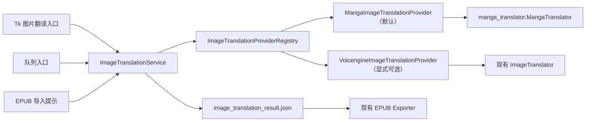

# Manga Image Translator 模块接入规划

> 文档状态：待评审  
> 编写日期：2026-07-15  
> 目标项目：`AI-translater-1.4`  
> 待接入源码：`D:\manga-image-translator-main`

## 1. 结论摘要

本次改造建议把 `manga-image-translator` 的“检测、OCR、翻译、去字、修复、嵌字”流水线接入为统一图片翻译接口下的默认实现；现有火山引擎 Doubao-SeeDream 图生图实现保留为用户明确选择的“AI 图片翻译”。系统不得根据检测结果、错误类型或 API 配置自动切换到 AI 图片翻译。

目标行为如下：

| 场景 | 目标行为 |
|---|---|
| 点击主界面“图片翻译” | 直接运行 Manga 默认模块 |
| 导入 EPUB 后选择翻译图片 | 运行 Manga 默认模块 |
| 使用 AI 图片翻译 | 用户从独立菜单/对话框明确选择并二次确认 |
| Manga 模块未安装、模型缺失或运行失败 | 显示修复指引或失败结果，不自动调用 AI |
| 未配置火山引擎 Key | 不影响 Manga 默认模块 |
| Manga 处理后无可翻译文字 | 保留原图并标记“无需翻译”，不调用 AI |

接入采用 Provider/Adapter 结构，EPUB 导出继续消费现有的 `result_map`，避免重写 EPUB 替换逻辑。

## 2. 范围与术语

### 2.1 本期目标

1. 将 `manga-image-translator` 作为可测试、可替换的进程内 Python 模块接入。
2. 将 Manga Provider 设为所有图片翻译入口的默认实现。
3. 将现有火山图生图封装为 AI Provider，只允许用户显式调用。
4. 复用本项目现有 OpenAI 兼容文本翻译配置，不新增一套必须重复填写的文本翻译密钥。
5. 保持 `image_translation_result.json` 和 EPUB 导出链路向后兼容。
6. 支持进度、取消、部分成功、失败重试、模型缓存和资源释放。
7. 完成开发环境、PyInstaller 打包和干净 Windows 环境验收。

### 2.2 非目标

- 不接入外部项目的 CLI、Web 前端、FastAPI 服务和 MangaStudio GUI。
- 不把整个外部仓库直接复制进 `src/core`。
- 不在本期开放外部引擎的全部检测器、OCR、翻译器和渲染参数。
- 不实现 Manga 失败后自动降级到 AI 图片翻译。
- 不改变正文翻译 Provider 的默认选择。
- 不重写 EPUB 导入、图片资源存储和导出器。

### 2.3 术语约定

- **Manga 图片翻译**：`manga-image-translator` 的确定性流水线，即文本检测、OCR、文本翻译、原文擦除和译文渲染。
- **AI 图片翻译**：当前 `src/core/image_translator.py` 使用 Doubao-SeeDream 直接生成新图片的能力。
- Manga 流水线中的文本翻译可以调用 LLM，但它不等同于本规划中的“AI 图片翻译”。“AI 图片翻译”专指图生图 Provider。

## 3. 现状调查

### 3.1 当前项目调用链

当前存在两条图片翻译路径：

1. `src/core/image_text_translator.py`
   - 先调用视觉模型判断是否存在非中文文字。
   - 再调用 `ImageTranslator` 执行火山图生图。
   - 这是当前界面标记为“推荐”的智能检测路径。
2. `src/core/image_translator.py`
   - 对图片直接调用 Doubao-SeeDream。
   - 输出 `original_epub_path -> translated_file` 映射。

入口分散在以下位置：

- `src/ui/image_translation_handler.py`：主窗口图片翻译选择和工作线程。
- `src/ui/file_importer.py`：导入 EPUB 后询问是否自动进行智能图片翻译。
- `src/ui/main_window.py`：菜单、按钮和导入回调绑定。
- `src/ui/concurrent_window.py`：队列图片翻译，当前硬编码检查火山 Key。
- `src/ui/settings_window.py`：当前只有火山图生图和视觉模型相关设置。

结果由 `image_translation_result.json` 保存。`src/ui/translation_controller.py` 读取其中的 `result_map`，再交给 `src/infrastructure/exporter.py` 和 `src/infrastructure/image_rewriter.py` 替换 EPUB 图片。该契约可继续保留。

### 3.2 外部模块能力

外部核心入口为：

```python
MangaTranslator.translate(image: PIL.Image.Image, config: Config) -> Context
```

最终图片位于 `Context.result`。流水线顺序为：

```text
检测 -> OCR -> 文本区域合并 -> 文本翻译 -> 掩码 -> 图片修复 -> 译文渲染
```

外部模块提供 `translate_batch()`，但第一期建议复用一个 `MangaTranslator` 实例逐图调用 `translate()`：这样可以保留跨页文本上下文，同时降低批量显存峰值并简化单图失败、进度和取消语义。完成性能基线后再决定是否启用批量入口。

已确认的适配事项：

- 外部项目要求 Python `>=3.10,<3.12`，当前项目的 Python 3.11 目标可兼容。
- 外部依赖包含 Torch、OpenCV、ONNX Runtime、Transformers、Rust 扩展等，不能直接把完整 `requirements.txt` 合并进主依赖。
- 外部 `openai==1.63.0`、`httpx==0.27.2`、`pydantic==2.5.0` 等固定版本需要与当前项目做依赖解算和回归测试。
- 当前本地源码的 `MangaTranslator` 构造参数实现要求适配器显式传入 `kernel_size`、`input` 等参数，不能依赖上游示例的空参数调用。
- 外部引擎没有完整的公开 `close()` 生命周期接口，需要在适配层补充取消后台任务、卸载模型和释放翻译客户端的统一清理逻辑。
- 外部 `external_llm` Translator 可通过 `TranslatorConfig` 直接接收 `base_url`、`api_key` 和 `model`，应使用它复用本项目 API 配置，禁止通过修改进程级环境变量传递密钥。

### 3.3 开源归属与版本记录

项目所有者已确认本项目为开源免费项目，GPL-3.0-only 不作为本次接入的实施或发布阻断项。接入时按常规开源项目要求保留外部项目的完整许可证、版权信息、源码获取方式和本地修改记录。

当前项目 README 声称使用 MIT，但仓库内未发现实际 `LICENSE` 文件。建议在本次接入时一并补齐项目根许可证文件和 `THIRD_PARTY_NOTICES.md`，让发行包中的许可证信息与仓库声明保持一致；此项与技术实施并行，不阻塞阶段 0。

当前 `D:\manga-image-translator-main` 的 `.git` 目录没有可用版本元数据。正式纳入前必须取得确切 upstream commit/tag；若只能使用当前本地快照，则生成全量文件 SHA-256 清单并记录来源日期，避免出现无法复现的第三方源码版本。

## 4. 目标交互

### 4.1 主界面

- 主按钮“图片翻译”直接启动 Manga Provider，不再先弹出“智能检测+插图翻译（推荐）”。
- 在“项目”菜单或按钮旁菜单中增加“AI 图片翻译...”。
- AI 入口使用明确名称，并在执行前提示“将调用火山图生图服务并可能产生 API 费用”。
- 一次性选择 AI 不得改变后续默认值；下次点击主按钮仍运行 Manga Provider。
- Manga 失败时只显示失败原因、重试和设置入口，不显示自动切换 AI 的倒计时或默认确认。

### 4.2 EPUB 导入

保留导入后询问，但文案改为：

```text
检测到 EPUB 包含 N 张图片，是否使用默认图片翻译模块处理？
```

确认后调用 Manga Provider。取消后不执行任何图片翻译。导入流程不检查火山 Key。

### 4.3 设置

“插图翻译设置”调整为“图片翻译设置”，分为两个清晰区域：

- Manga 默认模块：设备、模型状态、模型目录、首次下载/检测、基础质量档位。
- AI 图片翻译：火山 API Key、连接测试和费用提示。

第一期仅暴露稳定的预设：

| 预设 | 检测尺寸 | 修复尺寸 | 设备 | 用途 |
|---|---:|---:|---|---|
| 标准（默认） | 1536 或经性能验证后的值 | 1536 | 自动/CPU | 普通 EPUB 插图 |
| 高质量 | 2048 | 2048 | GPU 优先 | 漫画页和高分辨率图片 |
| 低内存 | 1024 | 1024 | CPU | 低配置设备 |

具体数值须由阶段 0 性能试验确认，不能直接把外部项目全部参数暴露给普通用户。

## 5. 目标架构



### 5.1 领域模型

新增 `src/domain/image_translation.py`：

```python
class ImageTranslationProviderId(str, Enum):
    MANGA = "manga"
    AI_VOLCENGINE = "ai_volcengine"

@dataclass(frozen=True)
class ImageTranslationRequest:
    mapping_dir: Path
    target_language: str
    provider_id: ImageTranslationProviderId
    selected_images: tuple[str, ...] | None = None

@dataclass(frozen=True)
class ImageTranslationProgress:
    stage: str
    current: int
    total: int
    image_path: str = ""

@dataclass
class ImageTranslationResult:
    status: OperationStatus
    result_map: dict[str, str]
    skipped_images: list[str]
    failed_images: dict[str, str]
```

错误信息不得包含 API Key、完整 Base64、请求头或模型服务原始鉴权响应。

### 5.2 Provider 端口

在 `src/application/ports.py` 增加 `ImageTranslationProvider`：

```python
class ImageTranslationProvider(Protocol):
    provider_id: str

    def validate(self, request: ImageTranslationRequest) -> list[str]: ...
    def translate(
        self,
        request: ImageTranslationRequest,
        on_progress: Callable[[ImageTranslationProgress], None] | None = None,
    ) -> ImageTranslationResult: ...
    def cancel(self) -> None: ...
    def close(self) -> None: ...
```

约束：

- `cancel()` 和 `close()` 必须幂等。
- Provider 不直接访问 Tk 控件，也不显示 messagebox。
- Provider 不自行决定切换另一个 Provider。
- Provider 返回结构化部分成功结果，不用空字典混淆“无需翻译”和“全部失败”。

### 5.3 Application Service

新增 `src/application/image_translation_service.py`，统一负责：

- 校验 `mapping_dir/images.json`。
- 按显式 `provider_id` 从注册表取得 Provider。
- 组织进度、取消和最终状态。
- 将结果以原子方式写入 manifest。
- 更新项目的 `image_translation_done` / `image_translation_failed` 状态。
- 关闭 Provider 生命周期。

UI、导入器和队列只能调用该 Service，不再直接实例化 `ImageTranslator` 或 `ImageTextTranslator`。

### 5.4 Provider 实现

建议新增：

```text
src/infrastructure/image_translation/
├── __init__.py
├── registry.py
├── manga_provider.py
├── volcengine_provider.py
├── manifest_repository.py
├── language_codes.py
└── runtime.py
```

其中：

- `manga_provider.py` 只做本项目模型到外部 `MangaTranslator`/`Config` 的适配。
- `volcengine_provider.py` 包装现有 `src/core/image_translator.py`，第一期不重写稳定的 API 请求实现。
- `runtime.py` 在独立工作线程中持有一个 asyncio event loop，避免每张图片反复创建 event loop。
- `manifest_repository.py` 统一原子读写及 v1/v2 兼容。

## 6. Manga Provider 设计

### 6.1 输入与输出

1. 从 `images.json` 读取 EPUB 原始路径和资源元数据。
2. 通过 `load_image_bytes()` 读取二进制，不回退到业务层手工解析 Base64。
3. 使用 Pillow 解码并统一 EXIF 方向；限制最大像素数，拒绝损坏图片和解压炸弹。
4. 同一任务复用一个 `MangaTranslator` 实例，按 EPUB 图片顺序处理。
5. `Context.text_regions` 为空时记为 `skipped`，不生成替换映射。
6. `Context.result` 保存到 `translated_images/manga/<source_hash>.png`。
7. 只有文件成功原子落盘后才加入 `result_map`。

输出文件名必须基于原始 EPUB 路径和内容摘要，不能只使用 basename，避免不同目录同名图片互相覆盖。

### 6.2 默认引擎配置

第一期固定使用经过验收的窄配置集：

- Detector：`default`
- OCR：`48px`
- Inpainter：`lama_large`
- Renderer：`default`
- Translator：`external_llm`
- Batch size：`1`
- Colorizer/Upscaler：默认关闭
- `ignore_errors`：关闭，由本项目按图片记录失败
- `model_dir`：放到 `AppPaths` 管理的用户数据目录
- `font_path`：使用随程序分发且覆盖目标语言字符的字体

不能把模型缓存写到源码目录、当前工作目录或 PyInstaller 临时解压目录。

### 6.3 复用当前文本翻译配置

Manga Provider 从 `ConfigManager.get_api_config()` 获取：

- `base_url`
- `api_key`
- `model_name`
- 超时及必要的生成参数

然后构造外部 `TranslatorConfig`：

```python
TranslatorConfig(
    translator=Translator.external_llm,
    target_lang="CHS",
    external_llm_base_url=api_config["base_url"],
    external_llm_api_key=api_config["api_key"],
    external_llm_model=api_config["model_name"],
)
```

不得写入 `os.environ`，避免多任务运行时密钥和模型配置互相污染。

目标语言映射第一期为：

| 本项目值 | Manga 代码 |
|---|---|
| 中文 | CHS |
| 英文 | ENG |
| 日文 | JPN |
| 韩文 | KOR |
| 法文 | FRA |
| 德文 | DEU |
| 西班牙文 | ESP |

未映射语言在执行前报配置错误，不得静默回退为中文或英文。

### 6.4 进度与取消

将外部状态映射为本项目状态：

| 外部状态 | UI 文案 |
|---|---|
| detection | 检测文字 |
| ocr | 识别文字 |
| translating | 翻译文字 |
| mask-generation | 生成去字区域 |
| inpainting | 修复原图 |
| rendering | 渲染译文 |

取消令牌由 `ImageTranslationService` 持有。进度 hook 检测取消后抛出外部 `TranslationInterrupt`，适配器将其转换为项目统一的取消异常，并在 `finally` 中停止后台 cleanup task、卸载已加载模型、关闭 LLM 客户端和 event loop。

## 7. AI Provider 保留策略

现有 `ImageTranslator` 作为 `VolcengineImageTranslationProvider` 的内部实现保留。行为调整为：

- 只能由 `provider_id="ai_volcengine"` 的显式请求触发。
- 执行前校验火山 Key，并显示一次费用/生成式修改提示。
- 默认处理用户确认的范围；第一期可保持“全部图片”。
- 不再由视觉检测结果选择它，也不再标记为推荐路径。
- Manga Provider 失败、无文字或缺少模型时均不得调用它。

`ImageTextTranslator` 第一阶段保留为兼容代码，但从所有 UI 和队列入口断开；完成一个稳定版本后再删除，避免一次改造同时承担行为迁移和代码清理风险。

## 8. 配置迁移

建议新增配置结构：

```json
{
  "image_translation": {
    "default_provider": "manga",
    "manga": {
      "quality_preset": "standard",
      "device": "auto",
      "model_dir": "",
      "batch_size": 1
    },
    "ai_volcengine": {
      "provider": "volcengine"
    }
  }
}
```

迁移规则：

1. 配置缺少 `image_translation` 时自动补齐，`default_provider` 固定为 `manga`。
2. 保留旧 `image_gen_provider` 和密钥环中的 `volc:ark_api_key`，不删除用户 Key。
3. 旧 `image_text_translation_enabled` 不再控制默认模块，可保留一版仅用于兼容读取。
4. 用户单次选择 AI 不写回 `default_provider`。
5. 配置写入继续使用原子替换，迁移失败时保留旧文件并提示。

## 9. 结果 manifest

在保持 `result_map` 兼容的前提下升级到 v2：

```json
{
  "schema_version": 2,
  "provider": "manga",
  "status": "partial",
  "run_id": "uuid",
  "run_at": "2026-07-15T12:00:00+08:00",
  "source_fingerprint": "sha256",
  "config_fingerprint": "sha256",
  "result_count": 1,
  "result_map": {
    "OEBPS/Images/page-01.jpg": "translated_images/manga/abc123.png"
  },
  "skipped_images": ["OEBPS/Images/cover.jpg"],
  "failed_images": {
    "OEBPS/Images/page-02.jpg": "OCR failed"
  }
}
```

兼容要求：

- 现有导出器仍只读取 `result_map`。
- 每次运行即使结果为空也覆盖旧 manifest，防止导出过期图片。
- `source_fingerprint` 不匹配当前 EPUB 项目时，导出层拒绝使用旧结果。
- 失败原因做脱敏和长度限制。
- v1 裸字典和当前带 `result_map` 格式继续可读，但下一次成功保存升级为 v2。

## 10. 第三方源码与依赖管理

### 10.1 源码纳入方式

禁止依赖用户机器上的绝对路径 `D:\manga-image-translator-main`。建议直接以 Git subtree 或可追溯源码快照放入：

```text
third_party/manga-image-translator/
├── manga_translator/
├── fonts/                  # 仅保留运行所需字体
├── LICENSE
├── UPSTREAM.md             # upstream URL、commit/tag、导入日期
└── LOCAL_CHANGES.md        # 本项目兼容补丁
```

保持上游顶层包名 `manga_translator`，通过本地 Python package 安装进入构建环境；不要在运行时临时修改 `sys.path`。

只纳入实际运行所需源码和资源，不纳入 `front/`、`server/`、`demo/`、`training/`、MangaStudio 和测试数据。

### 10.2 依赖策略

新增独立锁定文件，例如 `requirements-image-manga.txt`，由选定流水线的真实导入和打包测试生成。不要直接复制外部完整依赖文件。

重点验证：

- Torch CPU/GPU wheel 与 Python 3.11、Windows 的兼容性。
- OpenCV、ONNX Runtime、Rust wheel、Freetype 和字体资源。
- `openai`、`httpx`、`pydantic`、`numpy` 的版本交集。
- 外部各注册表是否在 import 阶段强制加载未使用 Provider；必要时提交最小的延迟加载补丁并记录在 `LOCAL_CHANGES.md`。
- 所有模型下载 URL、哈希校验、缓存目录和离线行为。

### 10.3 PyInstaller

当前单文件规格不适合直接假设能容纳完整 ML 运行时。阶段 0 必须比较：

1. 继续 onefile 并加入 hooks/binaries/datas。
2. 改用 onedir，将 ML native libraries 和字体作为独立文件分发。
3. 主程序与同目录的引擎运行时包一起分发，但仍由进程内 Provider 导入。

无论采用哪种方式，默认发行包必须能使用 Manga Provider；不能出现界面显示默认模块、实际安装包却缺少依赖且只能改用 AI 的状态。模型可以首次使用时下载，但要提供下载进度、校验、失败重试、磁盘空间检查和离线说明。

## 11. 预计文件改动

| 文件/目录 | 计划改动 |
|---|---|
| `src/domain/image_translation.py` | 新增请求、进度、结果和 Provider ID |
| `src/application/ports.py` | 新增 `ImageTranslationProvider` 协议 |
| `src/application/image_translation_service.py` | 新增统一编排、取消和 manifest 保存 |
| `src/infrastructure/image_translation/` | 新增 Manga/AI Provider、注册表、运行时和语言映射 |
| `src/config/config_manager.py` | 新增配置 schema、默认值和旧配置迁移 |
| `src/ui/image_translation_handler.py` | 改为调用 Service；主入口固定 Manga，AI 独立入口 |
| `src/ui/file_importer.py` | 导入提示调用 Manga，不再检查火山 Key |
| `src/ui/main_window.py` | 调整菜单、按钮绑定，移除私有方法回调 |
| `src/ui/concurrent_window.py` | 队列通过 Service 选择 Manga，移除火山硬编码 |
| `src/ui/settings_window.py` | 分离 Manga 设置和 AI 设置 |
| `src/core/image_translator.py` | 作为 AI Provider 内部兼容实现保留 |
| `src/core/image_text_translator.py` | 断开入口并标记 deprecated，后续删除 |
| `translator.spec`、`hooks/` | 增加 ML 模块、native library、字体和资源打包规则 |
| `requirements-image-manga.txt` | 新增经过验证的图片引擎依赖锁定 |
| `third_party/manga-image-translator/` | 纳入已审计、可追溯的第三方源码快照 |
| `tests/` | 增加 Provider、Service、配置迁移、UI 行为和打包 smoke tests |

## 12. 实施阶段

### 阶段 0：版本固化和可行性试验

交付物：

- 第三方许可证、来源说明和 notices 模板。
- 可复现的 upstream commit/tag 或本地快照 SHA-256 manifest。
- Python 3.11 下最小脚本：输入一张图片，取得 `Context.result` 并保存。
- CPU/GPU 首次加载时间、单图耗时、峰值内存/显存、模型下载体积、安装体积。
- PyInstaller onefile/onedir 可行性结论。

退出条件：至少一个干净 Windows 环境可以完成单图翻译、依赖版本可解算、第三方源码版本可复现。

### 阶段 1：契约和安全网

交付物：

- 领域模型、Provider 端口、注册表和内存 Fake Provider。
- 当前 manifest/export 行为的 characterization tests。
- 默认 Provider 和旧配置迁移测试。

退出条件：不接入真实引擎时，Service 的成功、部分成功、失败和取消语义均有测试。

### 阶段 2：Manga Provider

交付物：

- 第三方源码快照及 provenance 文档。
- Pillow 输入、语言映射、外部 Config 构造和结果落盘。
- 进度映射、取消、超时、资源释放和模型缓存。
- 使用当前 API 配置的 `external_llm` 适配。

退出条件：固定图片样例在 CPU 上完成端到端翻译；无文字、损坏图片和单图失败不破坏整个任务。

### 阶段 3：应用服务和 manifest v2

交付物：

- `ImageTranslationService`。
- manifest v1/v2 兼容、原子保存、源指纹和配置指纹。
- EPUB 导出继续使用新结果，空结果能够清除旧映射。

退出条件：部分成功 EPUB 可导出，成功项被替换，失败/跳过项保留原图。

### 阶段 4：默认入口与 AI 显式入口

交付物：

- 主按钮、导入流程和队列默认调用 Manga。
- 独立“AI 图片翻译...”入口及确认提示。
- 设置界面分区。
- 断开 `ImageTextTranslator` 的所有自动入口。

退出条件：自动化测试证明 Manga 失败或无文字时 AI Provider 调用次数为 0；只有显式 AI 操作才会调用火山服务。

### 阶段 5：打包与发布

交付物：

- 锁定依赖、PyInstaller hooks/spec 和字体/动态库资源。
- 首次模型下载和缓存管理 UI。
- 干净 Windows 机器安装、启动、翻译、取消、重启和导出 smoke test。
- 第三方许可证、源码获取和修改说明。

退出条件：发行包默认路径可用，AI Key 为空时仍可运行 Manga；卸载/升级不会删除用户模型缓存和项目结果。

## 13. 测试计划

### 13.1 单元测试

- 目标语言映射完整，未知语言明确失败。
- 图片路径、同名文件、不同扩展名和格式魔数处理正确。
- Manga Provider 构造外部 Config 时不修改环境变量。
- 无文字返回 `skipped`；单图异常返回 `failed_images`。
- 取消和关闭幂等，event loop、客户端和后台任务被释放。
- manifest v1/v2 读取、空结果覆盖、原子写入和指纹校验。
- 默认 Provider 永远为 `manga`，一次性 AI 选择不被持久化。
- Manga 任意失败路径都不会调用 AI Fake Provider。

### 13.2 集成测试

最小 fixture 集：

- 日文竖排漫画页。
- 英文横排彩色插图。
- 无文字封面。
- 透明 PNG。
- 同名但位于不同 EPUB 目录的两张图。
- 损坏图片和超大尺寸图片。
- 包含部分成功结果的 EPUB。

校验项：

- 输出尺寸、方向、透明通道和真实媒体类型正确。
- 译文结果存在且原文区域已处理。
- 输出路径全部位于当前 `mapping_dir` 内。
- 导出 EPUB 可重新打开，图片引用有效且未破坏封面/目录。
- API Key、Base64 和请求体不出现在日志及 manifest。

### 13.3 行为测试

- 点击主按钮只调用 Manga。
- 导入后确认只调用 Manga。
- 点击 AI 入口、确认且 Key 有效时才调用 AI。
- AI 取消确认、缺 Key、Manga 失败、Manga 无文字均不调用 AI。
- UI 只在 Tk 主线程更新；关闭窗口后不执行残留 `after()` 回调。
- 队列取消后不继续下一图片的模型推理。

### 13.4 打包测试

- 无开发环境和无源码路径的干净 Windows 机器。
- 路径包含中文、空格和长路径。
- 首次模型下载中断后可恢复。
- CPU-only 机器可启动且不会误加载 CUDA DLL。
- GPU 机器的驱动不兼容时明确回退 CPU，但不切换 AI Provider。
- 应用重启后模型缓存和已完成图片映射可复用。

## 14. 验收标准

以下条件必须全部满足：

1. 代码、配置和构建脚本中不存在对 `D:\manga-image-translator-main` 的运行时依赖。
2. 新安装和旧配置升级后，图片翻译默认 Provider 均为 `manga`。
3. 未配置火山 Key 时，Manga 图片翻译仍能进入预检和执行流程。
4. AI Provider 仅能通过明确的 AI 入口触发；不存在自动 fallback。
5. Manga 无文字、失败、取消和缺模型场景的 AI 调用次数均为 0。
6. 结果继续被现有 EPUB 导出器正确替换，失败图片保留原图。
7. 空运行结果会清除旧映射，源 EPUB 变化后旧结果不会被复用。
8. 取消后后台线程、event loop、HTTP 客户端和模型任务可以结束。
9. 日志和持久化文件不包含密钥或图片 Base64。
10. 干净 Windows 发行包通过端到端 smoke test。
11. 发行包包含外部 GPL-3.0-only 许可证、上游来源和本地修改说明。

## 15. 风险与应对

| 风险 | 影响 | 应对 |
|---|---|---|
| 第三方许可证或来源信息遗漏 | 开源归属信息不完整 | 随源码纳入 LICENSE、UPSTREAM、LOCAL_CHANGES 和 THIRD_PARTY_NOTICES |
| ML 依赖导致安装包大幅膨胀 | 下载和启动体验下降 | 最小依赖审计、延迟加载、比较 onedir、模型首次下载 |
| Torch/ONNX/Rust wheel 冲突 | 构建或启动失败 | 固定 Python 3.11 和 wheel 矩阵，干净环境 CI |
| CPU 处理过慢 | 默认功能不可用 | 性能预设、GPU 检测、进度/取消、基准后确定尺寸 |
| 模型首次下载失败 | 功能阻塞 | 校验、断点恢复、缓存诊断和离线包说明 |
| 外部全局缓存泄漏配置/内存 | 多任务异常或占用过高 | 单任务运行时、显式 unload、配置指纹、生命周期测试 |
| 外部源码升级破坏适配 | 回归 | 固定版本、compatibility tests、记录本地补丁 |
| 生成图片与 EPUB MIME 不一致 | 阅读器无法显示 | 按格式魔数保存并由导出器设置正确媒体类型 |
| UI 多入口行为漂移 | 又出现隐式 AI 调用 | 所有入口只调用统一 Service，Provider 选择写行为测试 |

## 16. 回滚方案

- Provider 注册表保留功能开关 `manga_provider_available`，用于出现打包级故障时禁用入口并展示错误；该开关不得自动改选 AI。
- 保留当前 AI Provider 的独立显式入口和旧 manifest 读取能力至少一个稳定版本。
- manifest v2 保留 `result_map`，因此回滚到旧导出代码仍可读取主要结果。
- 配置迁移只新增字段，不删除旧火山设置和密钥。
- 第三方源码以独立目录和提交纳入，可单独回退，不与 EPUB 核心重构混在同一提交。

## 17. 实施前待确认事项

1. 默认发行包是否必须离线包含模型，还是允许首次使用时下载。
2. 最低硬件目标：CPU 核数、内存、是否要求无 GPU 可用。
3. 是否需要在第一期支持繁体中文；当前主设置只有“中文”，规划暂映射为 CHS。
4. 当前本地外部源码是否为必须采用的定制版本；若是，需要补充其来源和修改记录。

以上事项可在阶段 0 使用基准结果确定，不阻塞契约层和测试安全网的开发。
