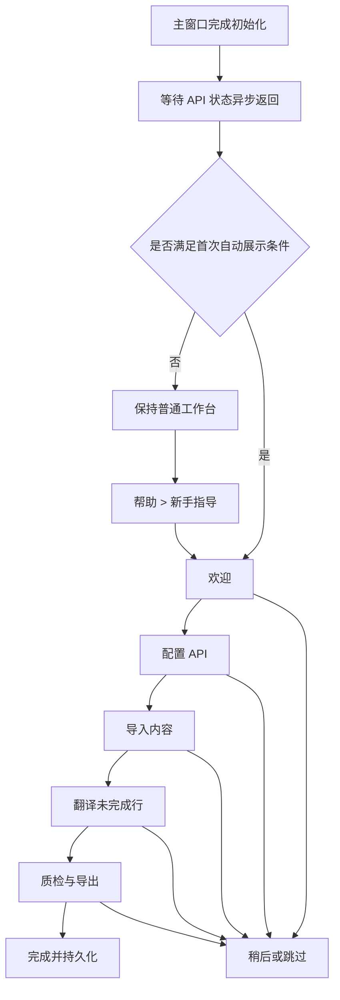

# 新手指导流程构建文档

## 1. 文档目的

本文档用于在当前 Tkinter 桌面翻译工具中新增一套可直接实施的新手指导流程。目标不是制作一次性的欢迎弹窗，而是帮助首次使用者完成以下认知路径：

1. 知道在哪里配置文本翻译 API。
2. 知道如何导入 EPUB、TXT 或剪贴板文本。
3. 理解主按钮会翻译未完成行，不会默认覆盖已有译文。
4. 知道如何筛选问题、运行质检并继续处理失败行。
5. 知道翻译结果会自动保存，并从哪里导出。

本文档已经固定 MVP 的交互、状态结构和代码边界，可以直接按照第 12 节开始编码。

## 2. 当前项目基线

当前主工作流集中在 `src/ui/main_window.py`：

- `MainWindow.create_toolbar()` 创建“导入文件”“粘贴文本”和“设置”入口。
- `MainWindow.create_work_area()` 创建空状态、筛选栏和原文/译文对照表。
- `MainWindow.create_control_panel()` 创建“翻译未完成行”、质检和导出入口。
- `MainWindow._run_primary_action()` 已根据内容和 API 状态切换主操作。
- `MainWindow._apply_api_status()` 异步接收 API 配置检查结果。
- `MainWindow.load_data_to_table()` 是内容成功进入工作台的稳定事件点。
- `SettingsWindow.save_settings()` 保存成功后会调用主窗口回调。
- `ConfigManager.load_app_config()` 会把缺失字段与默认配置合并。
- `ConfigManager.save_app_config()` 已通过原子写入保存应用配置。

因此，新手指导不应重复实现配置、导入或翻译逻辑。它只负责说明、导航、记录进度，并调用已有命令。

## 3. 已确定的产品决策

### 3.1 采用内联引导条

在主工具栏下方增加一个可展开的 `OnboardingPanel`，显示当前步骤、说明、进度和操作按钮。

不采用全屏遮罩或镂空聚光灯，原因如下：

- Tkinter 跨平台透明窗口和镂空遮罩行为不稳定。
- 遮罩容易拦截主界面点击，并造成键盘焦点陷阱。
- 翻译工具属于高频桌面工作台，轻量引导比沉浸式教程更合适。
- 内联面板可以让用户一边阅读，一边操作真实界面。

MVP 可以使用 `focus_set()` 把焦点移动到目标控件，但不修改全局 ttk 主题。目标控件高亮属于后续增强项。

### 3.2 引导可跳过、可稍后继续、可重新打开

- “稍后”只隐藏当前面板，保留进度，下次启动继续。
- “跳过指导”将状态记为 `dismissed`，以后不自动显示。
- 完成后将状态记为 `completed`，以后不自动显示。
- “帮助 > 新手指导”始终可以手动重新开始。

### 3.3 不强制产生费用或修改用户文件

引导可以打开设置、导入文件和定位主按钮，但不得自动执行以下行为：

- 不自动测试 API 连接。
- 不自动开始翻译。
- 不自动运行图片翻译。
- 不自动导出或覆盖文件。

用户必须通过原有按钮明确执行这些操作。

### 3.4 不新增第三方依赖

使用现有 `tkinter`、`ttk`、`ConfigManager` 和日志能力完成实现。

## 4. 用户流程



自动展示必须等 `_apply_api_status()` 收到结果后再判断，避免启动阶段在 Tk 主线程同步读取系统密钥环。

## 5. 自动展示规则

以下条件全部满足时自动显示：

```text
onboarding.status == "not_started"
AND onboarding.auto_show is True
AND api_configured is False
AND recent_files 为空
```

以下情况不自动显示：

- 状态为 `completed` 或 `dismissed`。
- `auto_show` 为 `False`。
- 已经配置 API。
- 已有最近项目，说明用户大概率已经使用过核心流程。
- 当前会话中用户点击过“稍后”。

手动从帮助菜单打开时使用 `start(force=True)`，忽略上述自动展示条件。

## 6. 引导步骤定义

| 步骤 ID | 标题 | 核心说明 | 主操作 | 自动完成事件 |
| --- | --- | --- | --- | --- |
| `welcome` | 开始使用翻译工作台 | 用五个短步骤了解配置、导入、翻译、质检和导出 | 开始指导 | 用户点击开始 |
| `api` | 配置文本翻译 API | 选择服务商、填写密钥和模型；密钥由系统凭据库保存 | 打开设置 | `api_status_changed(True)` |
| `import` | 导入需要翻译的内容 | 支持 EPUB、TXT 和剪贴板文本；已有译文会一并恢复 | 导入文件 | `content_loaded(count > 0)` |
| `translate` | 只翻译未完成行 | 主按钮会补译空白译文；不会默认覆盖已有译文或手工修改 | 定位主按钮 | 用户点击下一步，或 `translation_started` |
| `review_export` | 质检并导出 | 用筛选和质检定位问题；确认完成后导出 EPUB 或对照文件 | 定位质检筛选 | 用户点击完成 |

### 6.1 建议界面文案

#### `welcome`

- 标题：`第一次使用？用 1 分钟了解工作流`
- 正文：`按“配置 API、导入内容、补译、质检、导出”的顺序走一遍。你可以随时退出，并从“帮助”菜单重新打开。`
- 主按钮：`开始指导`

#### `api`

- 标题：`第 1 步：配置文本翻译 API`
- 正文：`选择服务商并填写 API 密钥和模型。保存成功后，本步骤会自动完成。`
- 已配置状态：`API 已配置，可以继续。`
- 主按钮：`打开设置`
- 次按钮：`以后配置`

#### `import`

- 标题：`第 2 步：导入内容`
- 正文：`导入 EPUB 或 TXT，也可以直接粘贴剪贴板文本。导入后原文会显示在对照表中。`
- 主按钮：`导入文件`
- 次按钮：`粘贴文本`

#### `translate`

- 标题：`第 3 步：翻译未完成行`
- 正文：`主按钮只处理原文非空且译文为空的行。开始前请确认目标语言、模型和待翻译数量。`
- 主按钮：`定位主按钮`
- 说明：定位后只设置键盘焦点，不触发翻译。

#### `review_export`

- 标题：`第 4 步：质检并导出`
- 正文：`翻译后可筛选未翻译行或质检问题。确认内容完整后，再导出 EPUB 或对照文件。`
- 主按钮：`定位质检筛选`
- 完成按钮：`完成指导`

## 7. 视觉与交互规范

### 7.1 面板布局

`OnboardingPanel` 放在工具栏与工作区之间，使用现有 ttk 主题：

```text
┌──────────────────────────────────────────────────────────────────────┐
│ 新手指导  2/5                                                        │
│ 第 1 步：配置文本翻译 API                                             │
│ 选择服务商并填写 API 密钥和模型。保存成功后，本步骤会自动完成。          │
│ [稍后] [跳过指导]                              [上一步] [打开设置]      │
└──────────────────────────────────────────────────────────────────────┘
```

实现约束：

- 面板宽度跟随主窗口，正文使用 `wraplength`，避免小窗口横向溢出。
- 使用 `ttk.LabelFrame` 或普通 `ttk.Frame`，不创建嵌套卡片。
- 标题使用 `TkDefaultFont` 加粗，正文沿用用户配置字体。
- 不使用 emoji、远程字体、插图或动画。
- 展开或收起只使用 `pack()` / `pack_forget()`，不做连续位移动画。
- 面板出现后优先聚焦主操作按钮，但不抢占正在编辑的文本焦点。
- 主窗口最小尺寸 `800x600` 下，面板正文最多三行。

### 7.2 键盘与可访问性

- 面板内 Tab 顺序必须和视觉顺序一致。
- `Alt+Left`：上一步。
- `Alt+Right`：下一步。
- `Escape`：等同“稍后”，不等同“跳过指导”。
- 不调用 `grab_set()`，用户始终可以操作主窗口。
- 不只通过颜色表达完成状态，应同时更新步骤文字。
- 所有按钮使用明确的文本标签，并保留可见焦点。
- 面板销毁或隐藏时解除自身注册的快捷键，避免污染主窗口。

## 8. 状态模型与持久化

在 `ConfigManager.default_app_config` 中增加：

```python
"onboarding": {
    "schema_version": 1,
    "status": "not_started",
    "current_step": "welcome",
    "completed_steps": [],
    "auto_show": True,
},
```

状态约束：

| 字段 | 允许值 | 说明 |
| --- | --- | --- |
| `schema_version` | 正整数 | 后续迁移使用 |
| `status` | `not_started`、`in_progress`、`completed`、`dismissed` | 引导总状态 |
| `current_step` | 第 6 节中的步骤 ID | 恢复时的当前位置 |
| `completed_steps` | 去重后的步骤 ID 列表 | 已确认或由业务事件完成的步骤 |
| `auto_show` | 布尔值 | 是否允许启动时自动恢复 |

持久化规则：

- 只在开始、前进、后退、稍后、跳过、完成时保存，不在每次渲染时写盘。
- 保存时先读取 `get_app_config()`，仅替换 `onboarding` 字段，再调用 `save_app_config()`。
- 配置损坏或出现未知步骤时，回退到 `welcome`，不得阻止主窗口启动。
- 保存失败时仍允许用户继续使用主程序，在状态栏显示“新手指导进度保存失败”。
- `ConfigManager.load_app_config()` 当前只对顶层做浅合并，因此引导代码必须对 `onboarding` 子字段再做一次默认值合并。

不要把引导进度写入仓库中的 `config/app_config.json`。运行时配置由 `AppPaths.config_dir` 指向用户数据目录。

## 9. 代码结构

### 9.1 新增 `src/ui/onboarding.py`

该文件包含三个小型对象，不引入业务层依赖。

```python
from dataclasses import dataclass
from typing import Callable, Mapping


@dataclass(frozen=True)
class OnboardingStep:
    step_id: str
    title: str
    body: str
    primary_label: str
    target_key: str | None = None


class OnboardingPanel:
    def __init__(self, parent, *, on_back, on_next, on_postpone, on_dismiss): ...
    def show_step(self, step, *, index, total, can_go_back, primary_command): ...
    def show(self): ...
    def hide(self): ...
    def close(self): ...


class OnboardingController:
    def __init__(
        self,
        *,
        root,
        panel,
        config_manager,
        targets: Mapping[str, Callable[[], object]],
        actions: Mapping[str, Callable[[], None]],
        status_updater: Callable[[str], None],
    ): ...

    def maybe_start(self, *, api_configured: bool, has_recent_files: bool): ...
    def start(self, *, force: bool = False): ...
    def next(self): ...
    def back(self): ...
    def postpone(self): ...
    def dismiss(self): ...
    def finish(self): ...
    def notify(self, event: str, **payload): ...
    def close(self): ...
```

职责边界：

- `OnboardingStep` 只保存静态步骤文案和目标键。
- `OnboardingPanel` 只渲染，不读取配置，不判断流程。
- `OnboardingController` 管理状态、事件推进、目标定位和持久化。
- `MainWindow` 只注册已有控件与已有命令。

### 9.2 修改 `src/ui/main_window.py`

#### 保存需要定位的控件

把当前匿名创建的按钮改为实例属性：

```python
self.import_file_btn = ttk.Button(...)
self.paste_text_btn = ttk.Button(...)
self.settings_btn = ttk.Button(...)
```

现有 `translate_btn`、`review_filter` 和 `export_epub_btn` 已经是实例属性。

#### 创建引导宿主

在 `setup_ui()` 中，放在 `create_toolbar()` 之后、`create_work_area()` 之前：

```python
self.create_onboarding_host(main_frame)
```

宿主初始不显示，由 `OnboardingPanel.show()` 负责 `pack()`。

#### 初始化控制器

在 `file_importer`、`translation_controller` 和全部界面控件创建完成后初始化：

```python
self.onboarding = OnboardingController(
    root=self.root,
    panel=OnboardingPanel(...),
    config_manager=self.config_manager,
    targets={
        "settings": lambda: self.settings_btn,
        "import": lambda: self.import_file_btn,
        "translate": lambda: self.translate_btn,
        "review": lambda: self.review_filter,
    },
    actions={
        "open_settings": self.open_settings,
        "import_file": self.file_importer.import_file,
        "paste_text": self.file_importer.import_clipboard,
    },
    status_updater=self.update_status,
)
```

使用 `lambda` 延迟读取目标控件，避免初始化顺序问题。

#### 接入业务事件

接入以下稳定事件点：

```python
# _apply_api_status()
self.onboarding.notify("api_status_changed", configured=bool(configured))

# load_data_to_table() 确认非空内容后
self.onboarding.notify("content_loaded", count=len(source_lines))

# _run_primary_action() 即将开始真实翻译前
self.onboarding.notify("translation_started")

# run_quality_check()
self.onboarding.notify("quality_check_run", issue_count=len(issues))
```

所有调用都应使用 `getattr(self, "onboarding", None)` 或保证控制器已初始化，防止测试通过 `MainWindow.__new__()` 构造半初始化对象时失败。

#### 帮助菜单入口

在“帮助”菜单第一项增加：

```text
新手指导
────────
支持作者
```

命令调用 `self.onboarding.start(force=True)`。

#### 关闭清理

在 `MainWindow.close()` 中调用 `self.onboarding.close()`，取消面板注册的 `after` 回调和快捷键。

### 9.3 修改 `src/config/config_manager.py`

只需增加默认 `onboarding` 段。MVP 不增加专用仓储类，也不为引导状态创建单独 JSON 文件。

### 9.4 新增 `tests/test_onboarding.py`

优先测试纯状态转换，不创建真实 Tk 窗口。使用假的 panel、config manager、target 和 action。

## 10. 事件推进规则

控制器收到业务事件时遵循以下规则：

```text
api_status_changed(True)
  -> 标记 api 完成
  -> 当前正位于 api 时自动前进到 import

content_loaded(count > 0)
  -> 标记 import 完成
  -> 当前正位于 import 时自动前进到 translate

translation_started
  -> 标记 translate 完成
  -> 不自动跳到结束，用户仍应看见质检说明

quality_check_run
  -> 标记 review_export 已接触
  -> 不自动把总状态改为 completed
```

事件发生在引导未显示时，也可以更新 `completed_steps`，但不得自动弹出面板。这样用户手动打开引导时，可以直接看到已经完成的步骤。

自动前进要通过 `root.after_idle()` 调度，避免在设置窗口销毁或表格加载回调栈中直接重绘布局。

## 11. 异常与边界处理

- API 状态检查失败：按未配置展示，不弹出额外错误。
- 用户取消设置窗口：停留在 `api` 步骤。
- 用户取消文件选择：停留在 `import` 步骤。
- 导入空文件：不完成 `import`。
- 用户在导入大文件时进入下一步：允许，但主按钮仍由现有 `_table_loading` 状态禁用。
- 用户点击“定位主按钮”：只调用 `focus_set()` 和 `see` 类定位逻辑，不调用按钮命令。
- 目标控件已销毁或暂时不存在：保留面板，忽略定位并记录 debug 日志。
- 主窗口尺寸改变：内联面板自然重排，不记录绝对坐标。
- 配置中存在未知 `current_step`：回退到第一个未完成步骤，否则回退到 `welcome`。
- 状态为 `in_progress` 且 `auto_show=True`：下次启动从 `current_step` 恢复。
- 状态为 `dismissed`：只能通过帮助菜单再次打开。

## 12. 推荐实施顺序

### 阶段 A：状态机与配置

1. 在 `ConfigManager.default_app_config` 增加 `onboarding` 默认段。
2. 新建 `src/ui/onboarding.py`，先实现步骤定义、子配置归一化和状态转换。
3. 使用假的配置管理器写状态机单元测试。

完成标准：不创建 Tk 窗口也能验证开始、前进、后退、稍后、跳过和完成。

### 阶段 B：内联面板

1. 实现 `OnboardingPanel`。
2. 在主窗口创建宿主并接入控制器。
3. 保存导入、粘贴和设置按钮实例。
4. 加入“帮助 > 新手指导”。

完成标准：可手动打开、浏览全部步骤、退出并重新打开。

### 阶段 C：业务事件联动

1. 在 `_apply_api_status()` 接入 API 状态事件。
2. 在 `load_data_to_table()` 接入内容加载事件。
3. 在翻译和质检入口接入非侵入式里程碑事件。
4. 实现首次自动展示与恢复。

完成标准：保存 API 或成功导入后，引导能自动进入下一步。

### 阶段 D：验证与收尾

1. 补齐配置损坏、未知步骤和保存失败测试。
2. 补齐 `MainWindow.__new__()` 半初始化对象兼容测试。
3. 在 800x600、1000x700 和高 DPI 环境手动检查布局。
4. 检查引导不会初始化翻译引擎、图片引擎或额外 API 客户端。

## 13. 测试清单

### 13.1 单元测试

- 默认配置会生成合法的 `not_started` 状态。
- 缺少部分子字段时会与默认值深合并。
- 未配置 API 且无最近文件时自动开始。
- 已配置 API 时不自动开始。
- 有最近文件时不自动开始。
- `force=True` 可以从帮助菜单重新开始。
- `next()` 和 `back()` 不会越界。
- `postpone()` 保留当前位置和 `in_progress` 状态。
- `postpone()` 设置仅存在于内存中的 `postponed_this_session` 标记，避免当前会话再次自动弹出。
- `dismiss()` 写入 `dismissed` 并禁止自动显示。
- `finish()` 写入 `completed`。
- API 配置成功会完成 `api` 并自动前进。
- 非空内容加载会完成 `import` 并自动前进。
- 空内容不会完成 `import`。
- 保存失败不会抛出异常阻断主界面。
- 未知步骤会安全回退。
- `close()` 可重复调用。

### 13.2 集成测试

- 主窗口启动时不新增同步密钥读取。
- 面板默认隐藏，符合条件时在 API 状态返回后显示。
- 点击“打开设置”只打开一个设置窗口。
- 设置保存回调后步骤自动推进。
- 文件导入完成后步骤自动推进。
- “定位主按钮”不会调用 `start_translation()`。
- 帮助菜单可以在完成或跳过后重新打开引导。
- 主窗口关闭后不残留 `after` 回调。

### 13.3 手工验收场景

| 场景 | 预期结果 |
| --- | --- |
| 全新用户首次启动 | API 状态返回后显示欢迎步骤 |
| 已配置 API 的老用户升级 | 不自动打扰，可从帮助菜单打开 |
| 用户点击“稍后”并重启 | 从原步骤恢复 |
| 用户点击“跳过指导”并重启 | 不再自动显示 |
| API 设置保存成功 | 自动进入导入步骤 |
| 用户取消文件选择 | 仍停留在导入步骤 |
| 成功导入大文件 | 内容开始加载，步骤进入翻译说明，主按钮保持原有加载状态 |
| 点击定位翻译按钮 | 按钮获得焦点，但不会产生 API 请求 |
| 800x600 窗口 | 文案不溢出，工作区仍可操作 |

## 14. 验收标准

功能完成必须同时满足：

- 新用户能在 1 分钟内理解主工作流。
- 所有步骤均可通过键盘访问。
- 用户可以稍后、跳过，并从帮助菜单重新打开。
- 引导不会自动产生 API 费用或修改导出文件。
- 引导状态跨重启保存，配置异常不影响应用启动。
- 已有用户不会因为升级被强制弹出教程。
- 引导不破坏主窗口现有的懒加载和启动性能。
- 新增状态机测试通过，现有 UI 启动测试继续通过。

## 15. MVP 之外的后续增强

以下内容不应进入第一版：

- 控件周围的跨平台浮动聚光灯。
- 视频、GIF 或远程图片教程。
- 自动模拟翻译任务。
- 云端同步引导进度。
- 行为分析或遥测上报。
- 针对图片翻译、队列和术语库的长教程。

第一版稳定后，可以在“帮助”菜单下增加三个独立的短指南：“文本翻译”“EPUB 图片翻译”“批量队列”。每个指南继续复用同一控制器和面板，不扩展主流程复杂度。
